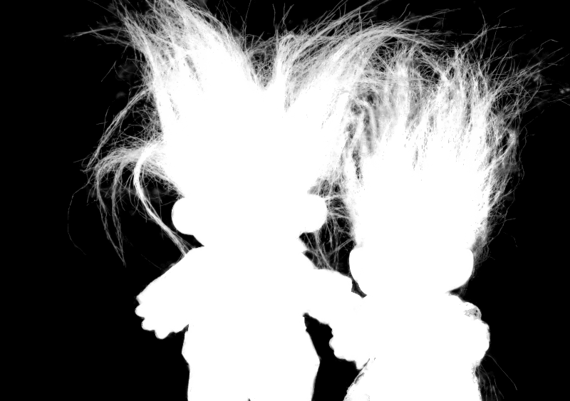

# Alpha Matting

This is an OpenCV2 version for algorithm described by paper:

>[Shared Sampling for Real-Time Alpha Matting](http://inf.ufrgs.br/~eslgastal/SharedMatting/)
  Eduardo S. L. Gastal and Manuel M. Oliveira
  Computer Graphics Forum. Volume 29 (2010), Number 2.
  Proceedings of Eurographics 2010, pp. 575-584.

## Usage

Refer to Readme.txt and main.cpp 

## Example

###input

###result

